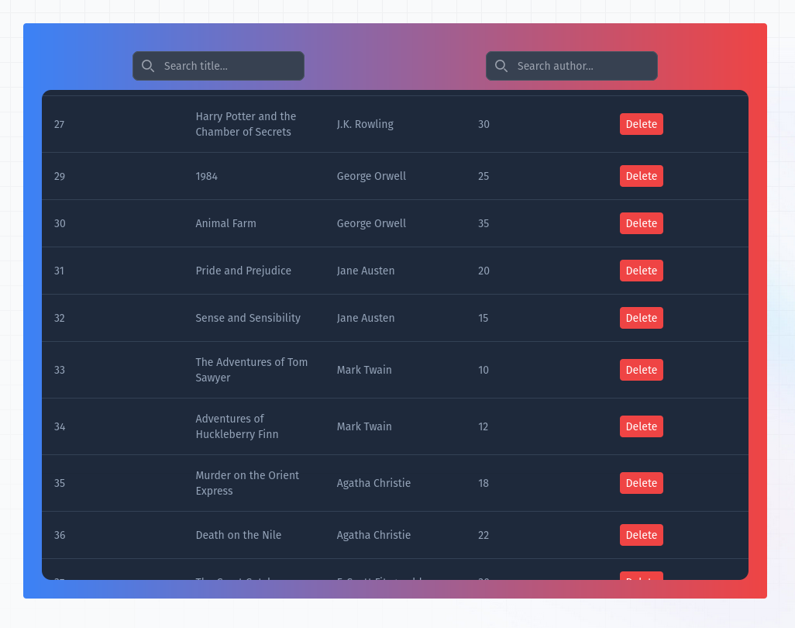
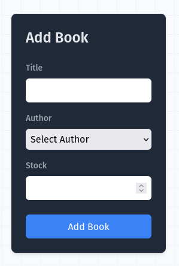
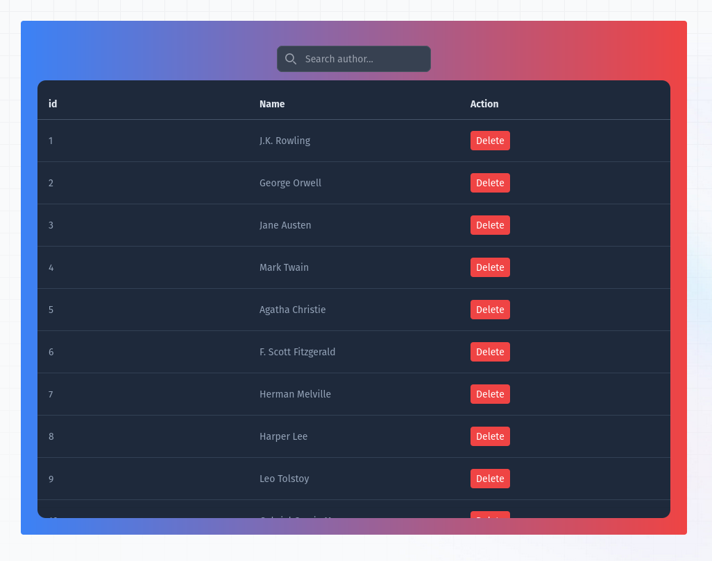
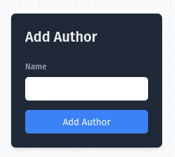

---

## **Anul 3: Tema PBD**
## **Proiect: Bibliotecă Online**


### **Mod de Funcționare**

- **Adăugare/Ștergere Cărți:**
  - Completează formularul de adăugare a cărților pe pagina dedicată.
  - Pentru ștergere, utilizează opțiunea de ștergere de pe pagina de vizualizare a cărților.

- **Adăugare/Ștergere Autori:**
  - Completează formularul de adăugare a autorilor pe pagina dedicată.
  - Pentru ștergere, utilizează opțiunea de ștergere de pe pagina de vizualizare a autorilor.

- **Consultare Cărți și Autori:**
  - Vizualizează toate cărțile sau toți autorii pe paginile dedicate.


---

#### **Queries pentru Adăugare, Ștergere și Selectare**

#### **Adăugare Carte**

```sql
-- Adăugare carte nouă
INSERT INTO Books (Title, AuthorId, Stock) VALUES ('Nume_Carte', Autor_Id, Cantitate_Stoc);
```

#### **Adăugare Autor**

```sql
-- Adăugare autor nou
INSERT INTO Authors (Name) VALUES ('Nume_Autor');
```

#### **Ștergere Carte**

```sql
-- Ștergere carte după ID
DELETE FROM Books WHERE id = Carte_Id;
```

#### **Ștergere Autor**

```sql
-- Ștergere autor după ID
DELETE FROM Authors WHERE id = Autor_Id;
```

#### **Vizualizare Cărți**

```sql
-- Selectare cărți
SELECT b.id AS BookId, b.Title as BookTitle, a.Name as BookAuthor, b.Stock as BookStock 
            FROM Books b 
            JOIN Authors a ON b.AuthorId = a.id 
            WHERE b.Title LIKE Book_Title AND a.Name LIKE Author_Name;
```

#### **Vizualizare Autori**

```sql
-- Selectare autori
SELECT id, Name FROM Authors WHERE Name LIKE Author_name;
```

---


### **Pagini**


#### **Imagini:**

- **Tabel Cărți:**
[](images/books.png)
- **Formular Adăugare Carte:**
[](images/form_books.png)
- **Pagina Autori:**
[](images/authors.png)
- **Formular Adăugare Autor:**
[](images/form_authors.png)


---